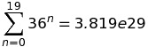

# IEEE Xtreme 2015 Fast SHA256 Crack
There was an interesting problem in the 2015 IEEE Xtreme programming competition involving cracking 100 provided Base64-encoded SHA256 hashes. The salt and peper applied to each hashed password were given.

Many of these passwords were common dictionary words, oftentimes transformed by appending a number at the beginning or end of the password. Others were dictionary words transformed into 1337-5P34K with a common set of transformations.

During the competition, my team and I got around 60 out of the 100 passwords by simply applying the above tranformations from both an expanded dictionary of English language words as well as using millions of common passwords from [this](https://github.com/danielmiessler/SecLists) repository.

## Encoding algorithm
The general encoding algorithm is fairly straightforward. Note that all passwords fit into the character space defined by [a-z0-9].

1. Prepend salt (the string 'IEEE' without quotes) and append pepper ('Xtreme') to password
2. Encode as UTF-8 data
3. Hash with sha256 hashing function
4. Encode the binary result as Base64

During the competition we did all of this with Python which led to a fairly short program. In order to get all possible passwords though, you would probably have to exhaustively iterate over the entire permutation space (with lengths from 0 - 19 characters), encode each one, and check it against the list of provided Base64-encoded hashes.

Some simple math:

* 36 possible characters
* 0 - 19 possible lengths
* 

Needless to say, this would take quite awhile with Python. Assumingly if you started early enough you could feasibly crack all of them by the end of the 24 hour period with the right amount of parallelism.
